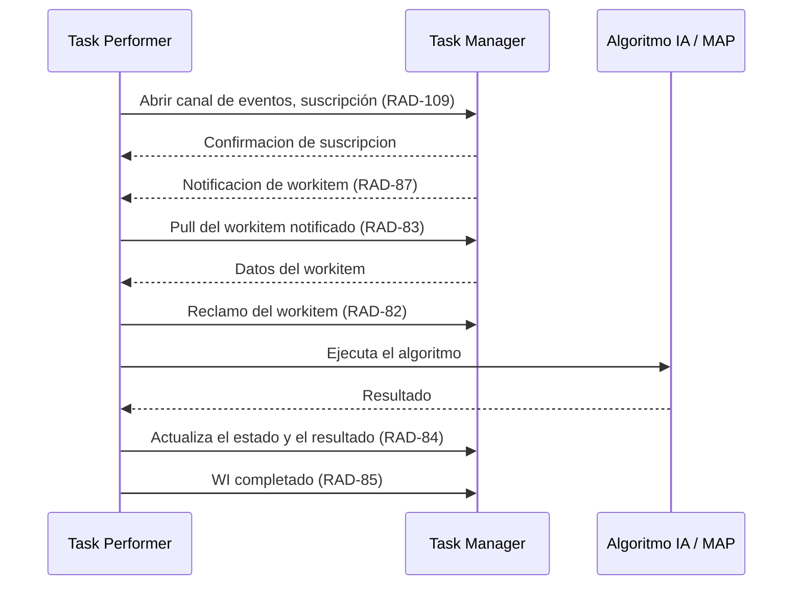

# Task Performer
Esta aplicación Spring Boot actúa como Task Performer conforme a [IHE-AIW-I, AI workflow for imaging](https://www.ihe.net/uploadedFiles/Documents/Radiology/IHE_RAD_Suppl_AIW-I.pdf).
Envuelve los algoritmos de IA del proyecto IntegralSkin y los ofrece como un servicio implementando el actor TaskPerformer de IHE AIW-I
La obtención de workitems desde el taskManager se basa en el servicio [Unified Procedure Step Service (UPS-RS) de Dicom]
(https://dicom.nema.org/medical/dicom/2019a/output/chtml/part18/sect_6.9.html), según el modelo Triggered-Pull.

Usa RAD_86 y RAD_87 para suscribirse y recibir notificaciones del TaskManager (la información de acceso al TaskManager estará en application.properties)

## Esquema IHE-AIW-I

# Getting Started

### Reference Documentation
For further reference, please consider the following sections:

* [Official Gradle documentation](https://docs.gradle.org)
* [Spring Boot Gradle Plugin Reference Guide](https://docs.spring.io/spring-boot/4.1.0/gradle-plugin)
* [Create an OCI image](https://docs.spring.io/spring-boot/4.1.0/gradle-plugin/packaging-oci-image.html)
* [Spring Web](https://docs.spring.io/spring-boot/4.1.0/reference/web/servlet.html)
* [Spring Boot DevTools](https://docs.spring.io/spring-boot/4.1.0/reference/using/devtools.html)
*[Librería DICOM, dcm4che](https://bradleyross.github.io/dcm4che/apidocs/)

### Guides
The following guides illustrate how to use some features concretely:

* [Building a RESTful Web Service](https://spring.io/guides/gs/rest-service/)
* [Serving Web Content with Spring MVC](https://spring.io/guides/gs/serving-web-content/)
* [Building REST services with Spring](https://spring.io/guides/tutorials/rest/)

### Additional Links
These additional references should also help you:

* [Gradle Build Scans – insights for your project's build](https://scans.gradle.com#gradle)

